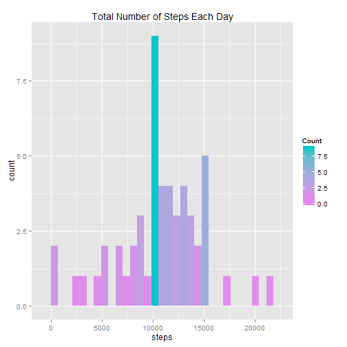
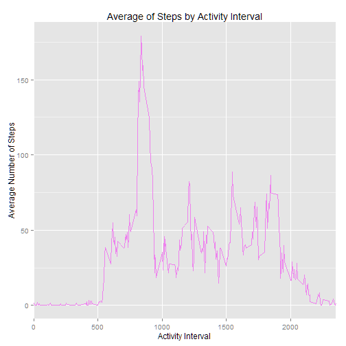
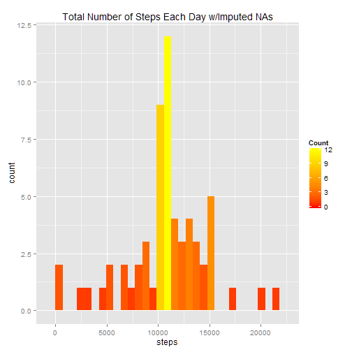
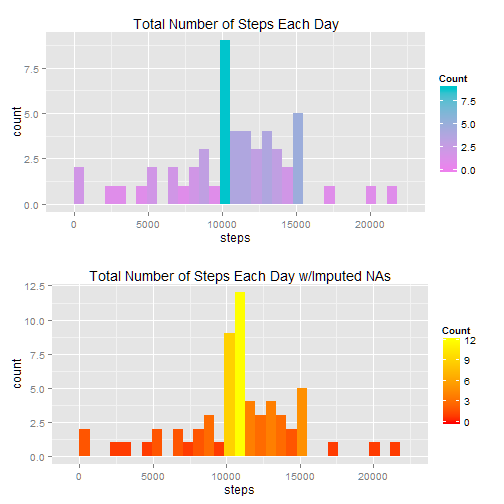

PEER ASSESSMENT ASSIGNMENT 1 - REPRODUCIBLE RESEARCH
====================================================

Data
=====

The data for this assignment can be downloaded from the course web site:
Dataset: Activity monitoring data [52K]

The variables included in this dataset are:

. Steps: Number of steps taking in a 5-minute interval (missing values are coded as NA)


. Date: The date on which the measurement was taken in YYYY-MM-DD format


. Interval: Identifier for the 5-minute interval in which measurement was taken


The dataset is stored in a comma-separated-value (CSV) file and there are a total of 17,568 observations in this dataset.


My Process:
===========

Load packages for knitr and ggplot2:

install.packages('knitr', dependencies = T)

library(knitr)

library(ggplot2)

Load data

```r
library(ggplot2)
MyData <- read.csv(file="D:\\reproducible research\\activity.csv", header=TRUE, sep=",")
```
Split data into groups by date and make a histogram of the total number of steps taken each day
==========

There was a lot of discussion on the boards about this first histogram. Many seemed to be confused by the wording of this part so I have created my histogram based on the explanation of this (first required histogram) by the community TA on this thread (https://class.coursera.org/repdata-004/forum/thread?thread_id=29)


```r
MyData.sum <- aggregate(MyData$steps,list(MyData$date),sum)
colnames(MyData.sum) <- c("date","steps")

Dataset1 <-ggplot(MyData.sum, aes(x=steps)) + geom_histogram(aes(fill = ..count..)) +
  scale_fill_gradient("Count", low = "violet", high = "turquoise3") +
 ggtitle("Total Number of Steps Each Day")
 
print(Dataset1)
```

```
## stat_bin: binwidth defaulted to range/30. Use 'binwidth = x' to adjust this.
```

 


Calculate and report the mean and median of the total number of steps taken per day
============

I did this by calling the summary function on my data set:


```r
summary(MyData.sum)
```

```
##          date        steps      
##  2012-10-01: 1   Min.   :   41  
##  2012-10-02: 1   1st Qu.: 8841  
##  2012-10-03: 1   Median :10765  
##  2012-10-04: 1   Mean   :10766  
##  2012-10-05: 1   3rd Qu.:13294  
##  2012-10-06: 1   Max.   :21194  
##  (Other)   :55   NA's   :8
```
Mean of total steps: 10766.18

Median of total steps: 10765

##Aggregate by Interval
##Add no NA Steps column and set NA to 0

```r
MyData$StepsNoNA <- MyData$steps
MyData$StepsNoNA[is.na(MyData$StepsNoNA)] <- 0
MyData.intervalmean <- aggregate(MyData$StepsNoNA,list(MyData$interval),mean)
colnames(MyData.intervalmean) <- c("Interval","Average")

ggplot(MyData.intervalmean, aes(x=Interval,y=Average)) + 
  geom_line(colour="violet") +
  scale_x_discrete(name="Activity Interval",breaks=c(seq(0,3000,500))) +
  scale_y_continuous(name="Average Number of Steps",breaks=seq(0,200,50)) +
  ggtitle("Average of Steps by Activity Interval")
```

 


Which 5-minute interval, on average across all the days in the dataset, contains the maximum number of steps?
============


```r
MyData.intervalmeanmax<- tail(MyData.intervalmean[order(MyData.intervalmean[,2]),],1)
MyData.intervalmeanmax$Interval
```

```
## [1] 835
```

Interval 835

Calculate and report the total number of missing values in the dataset (i.e. the total number of rows with NAs)
===========


```r
MyData.totalmissingvalues <-length(which(is.na(MyData$steps)))

MyData.totalmissingvalues
```

```
## [1] 2304
```

Total Missing Values : 2304


Create a new data set where NAs have been replaced with mean value
=========


Replace missing values with mean value of original data set and assign it to value "Data Set 2" and create new data set


Create a function called "impute.mean" which replaces NA with the mean value


```r
impute.mean <- function(x) replace(x, is.na(x), mean(x, na.rm = TRUE))
```

```r
library(plyr)

MyDataNAreplaced <- plyr::ddply(MyData[1:3],.(interval), transform,
                                steps = impute.mean(steps),
                                date = date,
                                interval = interval)
```


Of this new data set where NA is replaced with the mean value, make a histogram of the total number of steps taken each day and calculate and report the mean and median total number of steps taken per day.
=============


```r
MyDataNAreplaced.sum <- aggregate(MyDataNAreplaced$steps,list(MyDataNAreplaced$date),sum)
colnames(MyDataNAreplaced.sum) <- c("date","steps")

Dataset2 <-ggplot(MyDataNAreplaced.sum, aes(x=steps)) + geom_histogram(aes(fill = ..count..)) +
  scale_fill_gradient("Count", low = "red1", high = "yellow") +
ggtitle("Total Number of Steps Each Day w/Imputed NAs")

print(Dataset2)
```

```
## stat_bin: binwidth defaulted to range/30. Use 'binwidth = x' to adjust this.
```

 

Run summary function on this new data set to calculate mean and median of new data set


```r
summary(MyDataNAreplaced.sum )
```

```
##          date        steps      
##  2012-10-01: 1   Min.   :   41  
##  2012-10-02: 1   1st Qu.: 9819  
##  2012-10-03: 1   Median :10766  
##  2012-10-04: 1   Mean   :10766  
##  2012-10-05: 1   3rd Qu.:12811  
##  2012-10-06: 1   Max.   :21194  
##  (Other)   :55
```
Mean of new data set with imputed/NAs: 10766

Median of new data set with imputed/NAs: 10766

Compare Histograms for both data sets
=====


```r
library(grid)
library(lattice)
vplayout <- function(x, y) viewport(layout.pos.row = x, layout.pos.col = y)
 grid.newpage()
pushViewport(viewport(layout = grid.layout(2, 1)))
print(Dataset1, vp = vplayout(1,1))
```

```
## stat_bin: binwidth defaulted to range/30. Use 'binwidth = x' to adjust this.
```

```r
print(Dataset2, vp = vplayout(2,1))
```

```
## stat_bin: binwidth defaulted to range/30. Use 'binwidth = x' to adjust this.
```

 

Are there differences in activity patterns between weekdays and weekends?
====
 
Create a new factor variable in the dataset with two levels - "weekday" and "weekend" indicating whether a given date is a weekday or weekend day. Then seperate into 2 data sets - Data Set Weekdays, Data Set Weekends


```r
d.activityWeekendday <- MyDataNAreplaced.sum
d.activityWeekendday$DayName <- weekdays(as.Date(d.activityWeekendday$date,'%Y-%m-%d'))
```

Add WeekendDay column and populate with "Weekday"


```r
d.activityWeekendday$WeekendDay <- "Weekday"
```


Update WeekendDay colum with "Weekend" where DayName is Saturday or Sunday


```r
d.activityWeekendday$WeekendDay[d.activityWeekendday$DayName == "Sunday"] <- "Weekend"
d.activityWeekendday$WeekendDay[d.activityWeekendday$DayName == "Saturday"] <- "Weekend"
```
Plotting Weekend/Weekday Data Sets: 
====

Print top lines of new  data sets to make sure the code is correct before plotting:

Print top lines of the weekend data set to make sure the code is correct

```r
d.Weekendmean <- d.activityWeekendday[d.activityWeekendday$WeekendDay == "Weekend",]
head(d.Weekendmean)
```

```
##          date steps  DayName WeekendDay
## 6  2012-10-06 15420 Saturday    Weekend
## 7  2012-10-07 11015   Sunday    Weekend
## 13 2012-10-13 12426 Saturday    Weekend
## 14 2012-10-14 15098   Sunday    Weekend
## 20 2012-10-20 10395 Saturday    Weekend
## 21 2012-10-21  8821   Sunday    Weekend
```


 Print top lines of the weekday data set to make sure the code is correct
 

 

```r
d.Weekdaymean <- d.activityWeekendday[d.activityWeekendday$WeekendDay == "Weekday",]
head(d.Weekdaymean)
```

```
##         date steps   DayName WeekendDay
## 1 2012-10-01 10766    Monday    Weekday
## 2 2012-10-02   126   Tuesday    Weekday
## 3 2012-10-03 11352 Wednesday    Weekday
## 4 2012-10-04 12116  Thursday    Weekday
## 5 2012-10-05 13294    Friday    Weekday
## 8 2012-10-08 10766    Monday    Weekday
```

Make a panel plot containing a time series plot (i.e. type = "l") of the 5-minute interval (x-axis) and the average number of steps taken, averaged across all weekday days or weekend days (y-axis)

load packages:


```r
library(lattice)
library(Hmisc)
```

```
## Loading required package: survival
## Loading required package: splines
## Loading required package: Formula
## 
## Attaching package: 'Hmisc'
## 
## The following objects are masked from 'package:plyr':
## 
##     is.discrete, summarize
## 
## The following objects are masked from 'package:base':
## 
##     format.pval, round.POSIXt, trunc.POSIXt, units
```

```r
d.Weekendmean <- d.activityWeekendday[d.activityWeekendday$WeekendDay == "Weekend",]
d.Weekendmeaninterval <- aggregate(d.Weekendmean$steps,list(d.Weekendmean$interval),mean)
```

```
## Error: arguments must have same length
```

```r
 colnames(d.Weekendmeaninterval) <- c("Interval","Average")
```

```
## Error: object 'd.Weekendmeaninterval' not found
```

